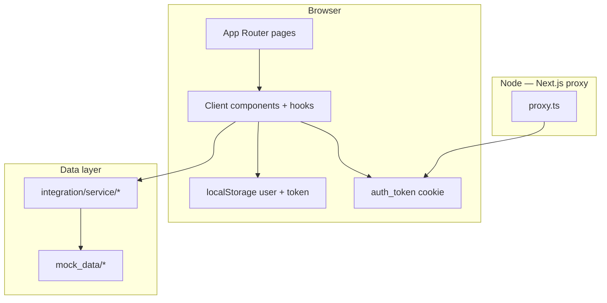

# ServerWatch — code documentation

This document describes how the **ServerWatch** demo app is structured, how data and auth flow through it, and where to change behavior when you extend or replace the mock backend.

---

## What this app does

ServerWatch is a **Next.js App Router** dashboard for monitoring a fleet of servers: list view with filters, sorting, grid/table layouts, and a per-server detail page. Authentication is **mocked** (in-memory + predefined credentials). Server data comes from **mock JSON** with simulated network delay.

---

## Tech stack (in use)

| Layer | Technology |
|--------|-------------|
| Framework | [Next.js](https://nextjs.org) 16 (App Router) |
| UI | React 19, [Tailwind CSS](https://tailwindcss.com) 4, [Geist](https://vercel.com/font) fonts |
| Icons | [Lucide React](https://lucide.dev) |
| Utilities | `clsx`, `tailwind-merge` (`lib/utils.ts` → `cn`) |

Dependencies such as `@mui/material` and `next-auth` are present in `package.json` but are **not wired into this codebase** yet; you can remove them or adopt them when you evolve the UI or auth.

---

## High-level architecture

- **Pages** load server data via **async Server Components** that call `integration/service/*`.
- **Client components** handle filters, forms, and URL state; they read auth from **localStorage** via `lib/auth.ts`.
- **Proxy** (`proxy.ts`, Next.js 16 file convention — replaces deprecated `middleware.ts`) reads the **`auth_token` cookie** (set on login/signup) to protect `/dashboard` and redirect logged-in users away from `/login` and `/signup`.

---

## Directory map

| Path | Role |
|------|------|
| `app/` | Routes, layouts, metadata, loading UI. Route groups: `(auth)`, `(dashboard)`. |
| `proxy.ts` | Next.js [proxy](https://nextjs.org/docs/app/api-reference/file-conventions/proxy) — auth redirects for protected vs public routes (`export function proxy`). |
| `lib/` | App constants (`constants.ts`), session helpers (`auth.ts`), formatting (`utils.ts`). |
| `integration/` | API-shaped **service** functions, **payload/response types**, and **mock data**. |
| `hooks/` | Reusable client hooks (`useQueryParams`, `useDashboardFilters`). |
| `helpers/` | Pure functions (e.g. `filterServers`, `sortServers`). |
| `components/common/` | Design-system style building blocks: atoms → molecules → organisms → templates. |
| `components/ui/` | Feature screens: `auth/*`, `dashboard/*`. |

Path alias: `@/*` → project root (`tsconfig.json`).

---

## Routing

| URL | Behavior |
|-----|----------|
| `/` | Redirects to `/dashboard`. |
| `/login`, `/signup` | Auth screens; `proxy.ts` sends authenticated users to `/dashboard`. |
| `/dashboard` | Server list, stats, filters (mock `getServers`). |
| `/dashboard/[server_id]` | Single server detail (mock `getServerById`). |

---

## Authentication

### Client: `lib/auth.ts`

- **`saveSession`** — After successful login/signup, stores `access_token` and serialized user in `localStorage`, and sets cookie `auth_token=...` with expiry aligned to `expires_at`.
- **`clearSession`** — Clears storage and expires the cookie (logout).
- **`getToken` / `getUser` / `isAuthenticated`** — Read helpers for client code.

### Server edge: `proxy.ts`

- Reads `auth_token` from the request cookie.
- If path is under **`ROUTES.dashboard`** and there is no token → redirect to **`ROUTES.login`**.
- If path is login/signup and token exists → redirect to **`ROUTES.dashboard`**.

Protected paths and route constants live in `lib/constants.ts` (`ROUTES`).

### Mock auth: `integration/service/auth.service.ts`

- **`login`** — Matches `MOCK_CREDENTIALS` in `integration/mock_data/auth.mock.ts`, or accounts created in-session via **`signup`** (stored in a module-level `Map`; lost on full reload in dev).
- **`signup`** — Validates passwords, rejects duplicate emails, returns a user + token shape matching `LoginResponse` / `SignupResponse`.

---

## Server data

### Service layer: `integration/service/server.service.ts`

- **`getServers`** — Accepts `FetchServersPayload` (search, status, sort, pagination). Uses `filterServers` / `sortServers` from `helpers/index.ts` on `MOCK_SERVERS`, then slices for the requested page.
- **`getServerById`** — Finds one server by id or throws.

Types: `integration/types/payload/server.payload.ts`, `integration/types/response/server.response.ts`.

### Mock data: `integration/mock_data/servers.mock.ts`

Replace or branch this module when you connect a real API; keep the same function signatures in the service layer so pages stay unchanged.

---

## UI composition

The project follows a loose **atomic design** split:

- **`components/common/atoms`** — `Button`, `Input`, `Typography`, `Badge`, `Skeleton`, etc.
- **`components/common/molecules`** — Composed pieces (`FormField`, `SearchBar`, `StatusBadge`).
- **`components/common/organisms`** — Larger blocks (`Navbar`, `ServerCard`, `ServerTable`).
- **`components/common/templates`** — Page shells (`AuthTemplate`, `DashboardTemplate`).
- **`components/ui/*`** — Page-specific wiring (`LoginPage`, `DashboardPage`, `ServerDetail`, etc.).

Feature pages under `app/` import templates + UI modules and pass data from server components where needed.

---

## Hooks

| Hook | Purpose |
|------|---------|
| `useQueryParams` | Syncs one or more URL search params with `router.push` (no scroll jump). |
| `useDashboardFilters` | Combines URL params (`status`, `view`) with local state for search and table sort. |

---

## Helpers

`helpers/index.ts` implements **pure** filtering and sorting for the in-memory server list. `DashboardPage` applies the same helpers client-side on `initialServers` for search/sort that should feel instant; the service layer can apply them again for real paginated APIs.

---

## Build and quality scripts

From `package.json`:

- `npm run dev` — Development server.
- `npm run build` — Production build.
- `npm run start` — Run production server.
- `npm run lint` — ESLint.

---

## Extending to a real backend

1. **Auth** — Replace `auth.service.ts` with `fetch` to your API; keep response types in `integration/types/response/auth.response.ts` or evolve them carefully.
2. **Servers** — Implement HTTP calls in `server.service.ts`; map responses into `Server` / list DTOs.
3. **Cookies** — If you use HTTP-only cookies from the server, adjust `lib/auth.ts` and `proxy.ts` so requests still carry a signal the proxy can read (or validate sessions/JWTs against your API inside the proxy).
4. **Environment** — Add `.env.local` for API base URLs and secrets; never commit secrets.

---

## Related files

- Product copy and default HTML metadata: `app/layout.tsx`.
- App name and route helpers: `lib/constants.ts`.

For user-facing setup and demo credentials, see the root [README](../README.md).
